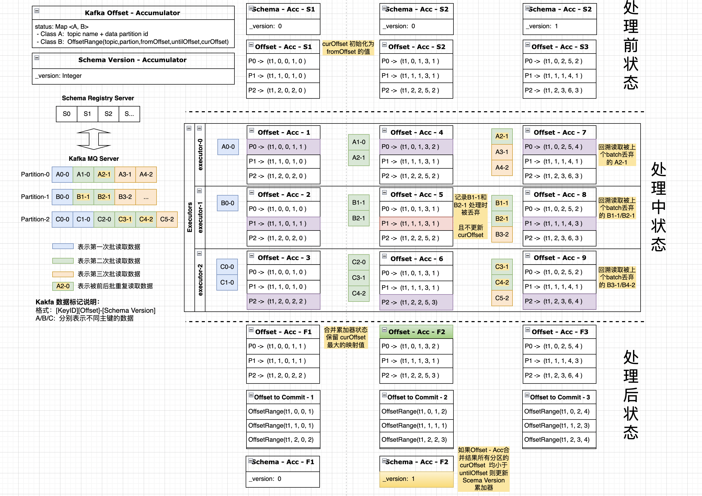

# Spark Streaming 读取 Kafka 存储 Iceberg 数据湖

基于 Spark Streaming / Kafka Connect / Confluent Schema Register Server / Apache Avro / Iceberg 等相关组建,将数据实时同步到 Iceberg 中。  
选择 Hive Catalog 进行数据存储。  
支持 Iceberg 表结构自适应变动 （添加列/ 删除列）- 修改列暂不支持

## 数据格式示列
丢弃 Key 域的值，仅保留 value 域的值
```shell
# 原始 Avro 数据
offset = 12, key={"ID": 1}, value={"type":"record","name":"Envelope","namespace":"test.db_gb18030_test.tbl_test","fields":[{"name":"before","type":["null",{"type":"record","name":"Value","fields":[{"name":"ID","type":"int"},{"name":"C1","type":["null","string"],"default":null},{"name":"C2","type":{"type":"string","connect.default":"CV2"},"default":"CV2"},{"name":"C3","type":["null","int"],"default":null},{"name":"C4","type":["null","long"],"default":null},{"name":"C5","type":["null","string"],"default":null},{"name":"CREATE_TIME","type":{"type":"long","connect.version":1,"connect.default":0,"connect.name":"io.debezium.time.Timestamp"},"default":0},{"name":"UPDATE_TIME","type":{"type":"long","connect.version":1,"connect.default":0,"connect.name":"io.debezium.time.Timestamp"},"default":0}],"connect.name":"test.db_gb18030_test.tbl_test.Value"}],"default":null},{"name":"after","type":["null","Value"],"default":null},{"name":"source","type":{"type":"record","name":"Source","namespace":"io.debezium.connector.mysql","fields":[{"name":"version","type":"string"},{"name":"connector","type":"string"},{"name":"name","type":"string"},{"name":"ts_ms","type":"long"},{"name":"snapshot","type":[{"type":"string","connect.version":1,"connect.parameters":{"allowed":"true,last,false,incremental"},"connect.default":"false","connect.name":"io.debezium.data.Enum"},"null"],"default":"false"},{"name":"db","type":"string"},{"name":"sequence","type":["null","string"],"default":null},{"name":"table","type":["null","string"],"default":null},{"name":"server_id","type":"long"},{"name":"gtid","type":["null","string"],"default":null},{"name":"file","type":"string"},{"name":"pos","type":"long"},{"name":"row","type":"int"},{"name":"thread","type":["null","long"],"default":null},{"name":"query","type":["null","string"],"default":null}],"connect.name":"io.debezium.connector.mysql.Source"}},{"name":"op","type":"string"},{"name":"ts_ms","type":["null","long"],"default":null},{"name":"transaction","type":["null",{"type":"record","name":"ConnectDefault","namespace":"io.confluent.connect.avro","fields":[{"name":"id","type":"string"},{"name":"total_order","type":"long"},{"name":"data_collection_order","type":"long"}]}],"default":null}],"connect.name":"test.db_gb18030_test.tbl_test.Envelope"} 
offset = 0, key={"ID": 2}, value={"type":"record","name":"Envelope","namespace":"test.db_gb18030_test.tbl_test","fields":[{"name":"before","type":["null",{"type":"record","name":"Value","fields":[{"name":"ID","type":"int"},{"name":"C1","type":["null","string"],"default":null},{"name":"C2","type":{"type":"string","connect.default":"CV2"},"default":"CV2"},{"name":"C3","type":["null","int"],"default":null},{"name":"C4","type":["null","long"],"default":null},{"name":"C5","type":["null","string"],"default":null},{"name":"CREATE_TIME","type":{"type":"long","connect.version":1,"connect.default":0,"connect.name":"io.debezium.time.Timestamp"},"default":0},{"name":"UPDATE_TIME","type":{"type":"long","connect.version":1,"connect.default":0,"connect.name":"io.debezium.time.Timestamp"},"default":0}],"connect.name":"test.db_gb18030_test.tbl_test.Value"}],"default":null},{"name":"after","type":["null","Value"],"default":null},{"name":"source","type":{"type":"record","name":"Source","namespace":"io.debezium.connector.mysql","fields":[{"name":"version","type":"string"},{"name":"connector","type":"string"},{"name":"name","type":"string"},{"name":"ts_ms","type":"long"},{"name":"snapshot","type":[{"type":"string","connect.version":1,"connect.parameters":{"allowed":"true,last,false,incremental"},"connect.default":"false","connect.name":"io.debezium.data.Enum"},"null"],"default":"false"},{"name":"db","type":"string"},{"name":"sequence","type":["null","string"],"default":null},{"name":"table","type":["null","string"],"default":null},{"name":"server_id","type":"long"},{"name":"gtid","type":["null","string"],"default":null},{"name":"file","type":"string"},{"name":"pos","type":"long"},{"name":"row","type":"int"},{"name":"thread","type":["null","long"],"default":null},{"name":"query","type":["null","string"],"default":null}],"connect.name":"io.debezium.connector.mysql.Source"}},{"name":"op","type":"string"},{"name":"ts_ms","type":["null","long"],"default":null},{"name":"transaction","type":["null",{"type":"record","name":"ConnectDefault","namespace":"io.confluent.connect.avro","fields":[{"name":"id","type":"string"},{"name":"total_order","type":"long"},{"name":"data_collection_order","type":"long"}]}],"default":null}],"connect.name":"test.db_gb18030_test.tbl_test.Envelope"} 

# 存储结构数据
+---------+---------------+----------+-------------+--------------+----------------+--------+-------+-------------+----------------------------------------+----------------+--------------------------+-----------------------------+--------------+-----------+--------------+---+---+---+---+---+----+-------------+-------------+
|_src_name|_src_db        |_src_table|_src_ts_ms   |_src_server_id|_src_file       |_src_pos|_src_op|_src_ts_ms_r |_tsc_id                                 |_tsc_total_order|_tsc_data_collection_order|_kfk_topic                   |_kfk_partition|_kfk_offset|_kfk_timestamp|ID |C1 |C2 |C3 |C4 |C5  |CREATE_TIME  |UPDATE_TIME  |
+---------+---------------+----------+-------------+--------------+----------------+--------+-------+-------------+----------------------------------------+----------------+--------------------------+-----------------------------+--------------+-----------+--------------+---+---+---+---+---+----+-------------+-------------+
|test     |db_gb18030_test|tbl_test  |1645690498000|1             |mysql-bin.000010|9164    |c      |1645690498874|e45b718e-906f-11ec-89e3-0242c0a8640a:220|1               |1                         |test.db_gb18030_test.tbl_test|1             |0          |1645690499261 |2  |A1 |A2 |1  |1  |null|1645157193000|1645690414000|
|test     |db_gb18030_test|tbl_test  |1645690414000|1             |mysql-bin.000010|8775    |u      |1645690414404|e45b718e-906f-11ec-89e3-0242c0a8640a:219|1               |1                         |test.db_gb18030_test.tbl_test|0             |12         |1645690414488 |1  |v1 |v2 |5  |12 |null|1645157193000|1645690414000|
+---------+---------------+----------+-------------+--------------+----------------+--------+-------+-------------+----------------------------------------+----------------+--------------------------+-----------------------------+--------------+-----------+--------------+---+---+---+---+---+----+-------------+-------------+
```

## Schema  管理说明
Schema 信息 维护 (使用 Avro Schema 作为 Schema 信息的综合转化节点)  

1、 Iceberg Schema 产生： Avro Schema -> Iceberg Schema -> Spark Schema  
2、 Schema 更新： Old Avro Schema -> New Avro Schema -> Generate Iceberg DDL SQL -> Apply to Iceberg Table  
3、 Schema 更新检测:   
 - Avro GenericRecord Schema -> Schema HashCode   
 - SchemaAccumulator -> Schema Version -> Schema -> Schema HashCode  

## 附加数据信息
用户可根据需要, 配置附加所需的额外信息, 支持的列参数配置入下所示  
```properties
record.metadata.source.columns = name, db, table, ts_ms, server_id, file, pos
record.metadata.source.prefix = _src_
record.metadata.transaction.columns = id, total_order, data_collection_order
record.metadata.transaction.prefix = _tsc_
record.metadata.kafka.columns = topic, partition, offset, timestamp
record.metadata.kafka.prefix = _kfk_
```

## Schema 版本更新处理逻辑
- 使用 Kafka Commit Offset 来记录数据处理消费的位点信息。
- 程序启动时从 Kafka Server 中，获取前次最后 Commit Offset, 然后根据一定的处理逻辑获取到当前正在处理的 Schema 版本，并作为作为初始化时的 Schema 版本。
- 使用 Avro Schema HashCode 来快速检测被处理数据的 Schema 版本是发生变动。
- 如果 Schema HashCode 相等，则解析该记录, 且保存并记录该已完成解析的 Offset 位点(记为 curOffset), 该位点用于微 batch 结束后, 指定 Kafka 的 Commit Offset 位点。   
- 如果 Schema HashCode 不相等，则丢弃该记录, 且不更新上述所提及的当前完成处理的 Offset 位点(记为 curOffset)
- 当一个微 batch 批结束后, 立即检测 Kafka Topic 各个 Partition 当前完成的消费处理位点(curOffset), 并与该微批数据的起始位点(fromOffset)以及结束位点(untilOffset)进行对比, 判断是否需要更新当前的 Schema 版本。  
- 如果所有的数据分区都存在丢弃记录的情况(即 0 <= fromOffset < curOffset < untilOffset),则立即更新当前的Schema 版本, 否则使用当前 Schema 版本继续处理下一批次数据
- Schema 版本升级后,需回溯处理被之前的微批丢弃的新 Schema 版本数据（即需重新消费已经消费的数据）
- 由于 Spark Streaming 会保存上批次读取的 Kafka 数据的 untilOffset 位点, 并不检测该位点是否成功 Commit, 直接将其作为下一批次的起始位点(fromOffset),因此需要重启 Spark Steaming 进程, 来回溯重新读取之前被丢弃的数据
- 由于 Spark 是分布式计算框架, 因此构建了一个能在各个计算节点直接共享信息（当前的 Schema Version）的 Accumulator 类
入下图所示  
  


## Spark Structure Streaming 

## Example Data Format  
```text
{"before": null, "after": {"ID": 1, "C1": "v1", "C2": "v2", "C3": 1, "C4": 12, "CREATE_TIME": 1645157193000, "UPDATE_TIME": 1645157193000}, "source": {"version": "1.8.0.Final", "connector": "mysql", "name": "test", "ts_ms": 1645157221283, "snapshot": "last", "db": "db_gb18030_test", "sequence": null, "table": "tbl_test", "server_id": 0, "gtid": null, "file": "mysql-bin.000003", "pos": 57965, "row": 0, "thread": null, "query": null}, "op": "r", "ts_ms": 1645157221285, "transaction": null} 

{"before":{"test.db_gb18030_test.tbl_test.Value":{"ID":1,"C1":{"string":"v1"},"C2":"v2","C3":{"int":4},"C4":{"long":12},"CREATE_TIME":1645157193000,"UPDATE_TIME":1645163880000}},"after":{"test.db_gb18030_test.tbl_test.Value":{"ID":1,"C1":{"string":"v1"},"C2":"v2","C3":{"int":3},"C4":{"long":12},"CREATE_TIME":1645157193000,"UPDATE_TIME":1645163889000}},"source":{"version":"1.8.0.Final","connector":"mysql","name":"test","ts_ms":1645163889000,"snapshot":{"string":"false"},"db":"db_gb18030_test","sequence":null,"table":{"string":"tbl_test"},"server_id":1,"gtid":{"string":"e45b718e-906f-11ec-89e3-0242c0a8640a:117"},"file":"mysql-bin.000003","pos":60900,"row":0,"thread":null,"query":null},"op":"u","ts_ms":{"long":1645164439953},"transaction":{"io.confluent.connect.avro.ConnectDefault":{"id":"e45b718e-906f-11ec-89e3-0242c0a8640a:117","total_order":1,"data_collection_order":1}}}
{"before":{"test.db_gb18030_test.tbl_test.Value":{"ID":1,"C1":{"string":"v1"},"C2":"v2","C3":{"int":3},"C4":{"long":12},"CREATE_TIME":1645157193000,"UPDATE_TIME":1645163889000}},"after":{"test.db_gb18030_test.tbl_test.Value":{"ID":1,"C1":{"string":"v1"},"C2":"v2","C3":{"int":4},"C4":{"long":12},"CREATE_TIME":1645157193000,"UPDATE_TIME":1645163889000}},"source":{"version":"1.8.0.Final","connector":"mysql","name":"test","ts_ms":1645163889000,"snapshot":{"string":"false"},"db":"db_gb18030_test","sequence":null,"table":{"string":"tbl_test"},"server_id":1,"gtid":{"string":"e45b718e-906f-11ec-89e3-0242c0a8640a:117"},"file":"mysql-bin.000003","pos":61082,"row":0,"thread":null,"query":null},"op":"u","ts_ms":{"long":1645164439954},"transaction":{"io.confluent.connect.avro.ConnectDefault":{"id":"e45b718e-906f-11ec-89e3-0242c0a8640a:117","total_order":2,"data_collection_order":2}}}

+-------------------+--------------------+--------------------+---------+------+--------------------+-------------+
|                key|               value|               topic|partition|offset|           timestamp|timestampType|
+-------------------+--------------------+--------------------+---------+------+--------------------+-------------+
|[00 00 00 00 03 02]|[00 00 00 00 04 0...|test.db_gb18030_t...|        0|     0|2022-02-18 12:07:...|            0|
|[00 00 00 00 03 02]|[00 00 00 00 04 0...|test.db_gb18030_t...|        0|     1|2022-02-18 12:07:...|            0|
|[00 00 00 00 03 02]|[00 00 00 00 04 0...|test.db_gb18030_t...|        0|     2|2022-02-18 13:57:...|            0|
|[00 00 00 00 03 02]|[00 00 00 00 04 0...|test.db_gb18030_t...|        0|    11|2022-02-18 14:07:...|            0|
+-------------------+--------------------+--------------------+---------+------+--------------------+-------------+

```
